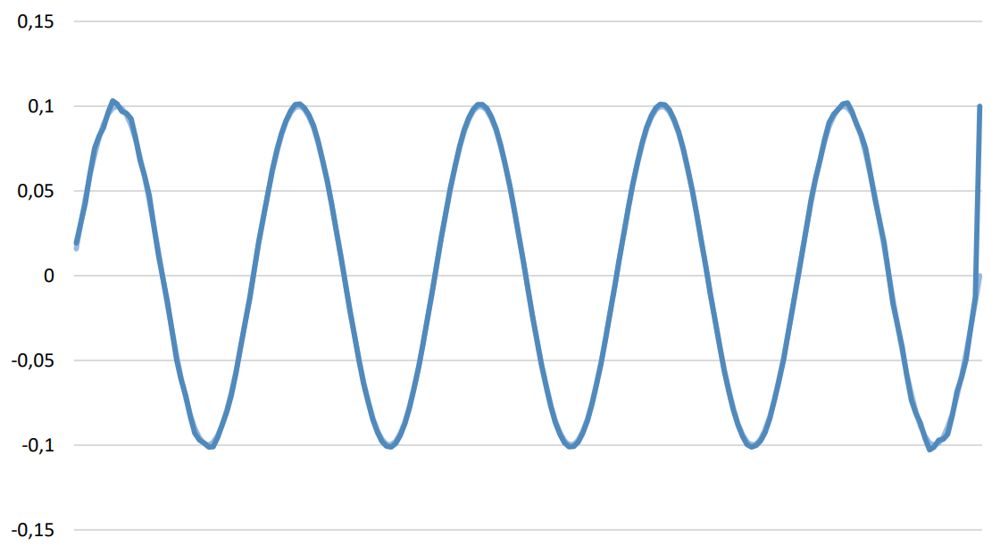

# Heat Equation with Reverse Time Method

## Problem Statement

This project implements a solution to the initial-boundary value problem for the heat equation with reverse time using the method of steepest descent. The goal is to analyze the temperature distribution across a 2D grid over time.

## Methodology

The code solves the heat equation on a grid using the method of steepest descent. Key steps include:

1. **Initialization**: Setting up the grid size, time step, and initial boundary conditions.
2. **Iterative Calculation**: Updating temperature values on the grid iteratively using the steepest descent method until convergence.
3. **Gradient Descent**: Minimizing the error function using gradient descent to optimize the temperature distribution.
4. **Final Calculation**: Adjusting the grid values according to the optimized gradient to achieve the desired heat distribution.

## Code Highlights

- **Grid Setup**: The grid is defined with `nx` and `ny` representing the dimensions along the X and Y axes.
- **Time Evolution**: The heat distribution is evolved over time using a finite difference approach.
- **Optimization**: The method of steepest descent is applied to minimize the error function and achieve the optimal solution.

## Results

The program outputs the final temperature distribution and the associated gradients, which can be visualized using the following image:

This project demonstrates the application of numerical methods in solving partial differential equations, specifically focusing on the heat equation with a reverse time component.
